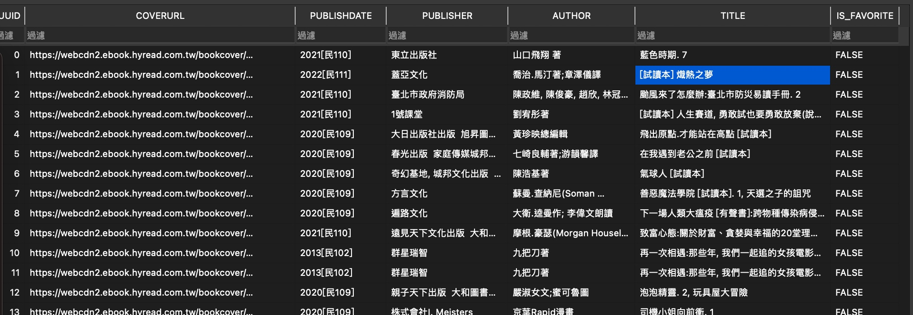

# HyRead-iOS-Exam
本專案是應徵 凌網科技股份有限公司_資深 iOS 工程師 測驗實作 - Adda

### iOS project 位置在 ./HyRead-iOS-Exam/HyReadExam_Swift

## 文件：
* [相關文件](https://github.com/hywebr00/ios-exam)
* [UI文件](https://www.figma.com/file/4aAUNkjFEd8q5RF1zbzCrI/HyRead?node-id=0%3A1&t=F5z1NRqj2ncWHHIl-0)
## 最低版本支援
- iOS14
- 使用Xcode 14.1 開發

## 架構： 
- MVVM 
## 使用第三方套件：

- 'RxSwift', '6.5.0'
- 'RxCocoa', '6.5.0'
- 'SDWebImage', '5.0'
- 'FMDB', '2.7.5' 

## 資料夾內容
- ApiService：Api串接實作
- Bundle： 專案基本 file - storyboar/AppDelegate .. 
- Extension：大多為型態轉型 Extension
- Utility：SqlManager/ImageHelper
- Page：使用者書籍頁面相關

- ../HyReadExam_SwiftTests
    -   實作API unit test/ Model unit test

## 服務串接

- **URL:**
    **`GET`**  https://mservice.ebook.hyread.com.tw/exam/user-list

- **Request header:**
    | header|  value|
    |:--:|:--:|
    |Content-type| application/json|

- **Response:**
    | 欄位|  說明|
    |:-----:|:-----:|
    |uuid |  唯一碼 |
    |title |  書名 |
    |coverUrl |  書封圖片 |
    |publishDate |  出版日期 |
    |publisher |  出版社 |
    |author |  作者 |

---
## Demo 畫面
<figcaption>資料庫操作</figcaption>

https://user-images.githubusercontent.com/26845772/222964987-903bcfa2-df18-4baa-b4a7-8cdc303197a0.mp4

<figcaption>iPhone直向</figcaption>

<figcaption>iPhone橫向</figcaption>

<figcaption>iPhone長按Cell_2</figcaption>

<figcaption>iPhone長按Cell_1</figcaption>

<figcaption>iPhone NaviButton 操作</figcaption>

<figcaption>iPad直向</figcaption>

<figcaption>iPad橫向</figcaption>

<figcaption>iPad長按Cell_2</figcaption>

<figcaption>iPad長按Cell_1</figcaption>

<figcaption>SQLLite DB</figcaption>

